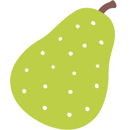

<p align='center'></p>
 <h1 align='center'>Pair</h1>

<p align="center">Pair seamlessly with Git when using Github</p>

<br /><br />

You love attributing your pairs when [committing together][together]? We all do!

But writing names once and again is repetitive enough that we forget doing it, isn't it?

Not anymore! Start your pairing sessions and switch pairs with a simple 🍐 command, while keeping control over your commit messages! Ready to get started?

  [together]: https://help.github.com/articles/creating-a-commit-with-multiple-authors/

Usage
-----

```bash
pair with "Gonzalo <gonzalo.bulnes@redbubble.com>" # that's all!

# Wanna pair swap?
pair with "Alice <alice@example.com>"

# Never stop pairing!
# Well, if you do:
pair stop
```

That sounds cool, [how does it work?](./doc/README.md)

Installation
------------

[](https://goreportcard.com/report/github.com/gonzalo-bulnes/pair)
[](https://travis-ci.org/gonzalo-bulnes/pair)

Binaries for official releases may be downloaded from the [releases page on GitHub](https://github.com/gonzalo-bulnes/pair/releases).

If you want to compile it from source, try:

```bash
go get github.com/gonzalo-bulnes/pair/...
```

For Unix/Linux users, you can install `pair` using the following command. You may want to change the version number in the command below from `v1.0.0-alpha` to whichever version you want:

```bash
curl -sL -o /usr/local/bin/pair \
    https://github.com/gonzalo-bulnes/pair/releases/download/v1.0.0-alpha/pair-linux-amd64 \
 && chmod +x /usr/local/bin/pair
```

Credits
-------

The pear emoji in the header was rendered from an SVG that belongs to Google and [was published under the Apache License v2.0 as part of Noto Emoji](https://github.com/googlei18n/noto-emoji).

Thanks to the team behind [`shush`][shush] for their inspiring `README`!

  [shush]: https://github.com/realestate-com-au/shush

License
-------

    Pair
    Copyright (C) 2018 Gonzalo Bulnes Guilpain

    This program is free software: you can redistribute it and/or modify
    it under the terms of the GNU General Public License as published by
    the Free Software Foundation, either version 3 of the License, or
    (at your option) any later version.

    This program is distributed in the hope that it will be useful,
    but WITHOUT ANY WARRANTY; without even the implied warranty of
    MERCHANTABILITY or FITNESS FOR A PARTICULAR PURPOSE.  See the
    GNU General Public License for more details.

    You should have received a copy of the GNU General Public License
    along with this program.  If not, see <http://www.gnu.org/licenses/>.
